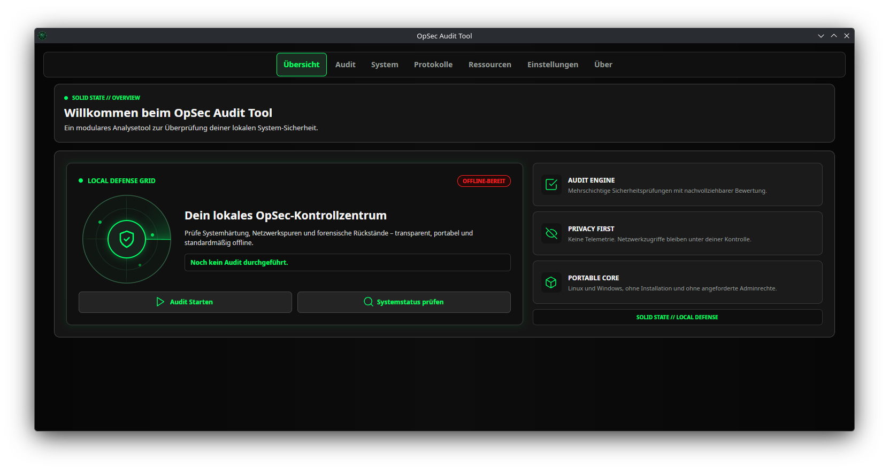
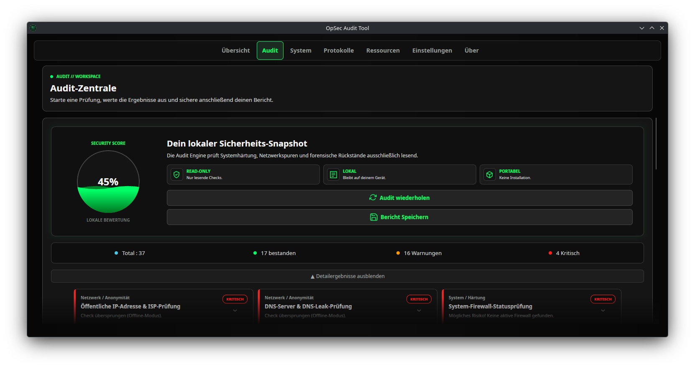

<p align="center">
  
</p>

<h1 align="center">OpSec Audit Tool</h1>

<p align="center">
  Portable OpSec-, Datenschutz-, Forensik- und Systemhärtungsprüfung für Linux
  und Windows.
</p>

<p align="center">
  <a href="https://github.com/SolidStateNetwork/OpSecAuditTool/releases/latest">
    
  </a>
  <a href="https://github.com/SolidStateNetwork/OpSecAuditTool/actions/workflows/build.yml">
    
  </a>
  <a href="LICENSE">
    
  </a>
</p>

> [!IMPORTANT]
> Die Anwendung liefert technische Hinweise, ersetzt aber keine professionelle
> Sicherheitsbewertung. Ergebnisse sollten immer im Kontext des verwendeten
> Systems geprüft werden.

## Download

| Plattform | Portables Paket |
|---|---|
| Linux x64 | [OpSecAuditTool-v1.0.0-linux-x64.tar.gz](https://github.com/SolidStateNetwork/OpSecAuditTool/releases/download/v1.0.0/OpSecAuditTool-v1.0.0-linux-x64.tar.gz) |
| Windows x64 | [OpSecAuditTool-v1.0.0-windows-x64.zip](https://github.com/SolidStateNetwork/OpSecAuditTool/releases/download/v1.0.0/OpSecAuditTool-v1.0.0-windows-x64.zip) |

Beide Pakete sind selbstenthalten und benötigen keine separate .NET-Installation.
Die zugehörigen [SHA-256-Prüfsummen](https://github.com/SolidStateNetwork/OpSecAuditTool/releases/download/v1.0.0/SHA256SUMS.txt)
stehen beim [aktuellen Release](https://github.com/SolidStateNetwork/OpSecAuditTool/releases/latest)
bereit.

## Screenshots

### Lokales OpSec-Kontrollzentrum



### System- und Sicherheits-Audit



## Eigenschaften

- lokale, ausschließlich lesende Sicherheits- und Systemprüfungen
- Betrieb als normaler Benutzer ohne angeforderte Administrator- oder Root-Rechte
- portable, selbstenthaltene Builds für Linux x64 und Windows x64
- nachvollziehbare Bewertung mit Pass-, Warnungs- und Fehlerstatus
- kompakte, aufklappbare Ergebniskarten mit stabiler Mehrspaltenansicht
- interaktives Kontrollzentrum mit animiertem Radar und direkten Schnellaktionen
- einheitliches, responsives Layout von der kompakten Standardgröße bis Vollbild
- kontrastreiches Cyber-Terminal-Theme mit neutral-schwarzen Flächen, Neon-Akzenten
  und klar getrennten Erfolgs-, Warn- und Fehlerfarben
- unmittelbar erkennbare Online-/Offline-Anzeige mit dynamischer grüner
  beziehungsweise roter Statusfarbe
- vollständig anklickbare Einstellungskarten mit konsistentem Hover- und
  Auswahlzustand
- kompakte Projekt- und Kontaktübersicht mit XMPP- und öffentlichem PGP-Schlüssel
- lokale Protokolle und exportierbare Audit-Berichte
- keine Werbung, keine extern geladenen Medien und keine Analyse-Telemetrie

## Projektstruktur

- `Core/` enthält die fachlichen Prüfungen. Jede Prüfung implementiert
  `IOpSecChecker` und liefert genau ein `CheckResult`.
- `Core/AuditCheckerCatalog.cs` definiert alle Prüfungen eines vollständigen Audits.
- `Models/` enthält reine Darstellungsmodelle für die Benutzeroberfläche.
- `Services/` kapselt Einstellungen, Logging, Berichte, Systeminformationen,
  Prozessabfragen und optionale Netzwerkzugriffe.
- `ViewModels/` stellt Zustand und Befehle für die Avalonia-Oberfläche bereit.
- `Views/` enthält XAML-Layouts und ausschließlich UI-nahe Logik.

## Bewertungsmodell

Jede Prüfung endet mit einem der folgenden Zustände:

- `Pass`: Die Prüfung wurde ausgeführt und das Ergebnis gilt als sicher.
- `Warning`: Die Prüfung wurde ausgeführt, erfordert aber Aufmerksamkeit.
- `Fail`: Kritisches oder nicht verlässlich prüfbares Ergebnis.

Der angezeigte Prozentwert ist bewusst einfach:

```text
erfolgreiche Prüfungen / alle Prüfungen × 100
```

Warnungen, kritische Ergebnisse, übersprungene Prüfungen und interne Fehler erhöhen
den Prozentwert nicht. Nicht ausführbare Prüfungen gelten als kritisch, weil ohne
ein verlässliches Ergebnis keine Sicherheit bestätigt werden kann.

## Netzwerkzugriffe

Netzwerkzugriffe sind standardmäßig deaktiviert. Werden sie in den Einstellungen
aktiviert, nutzt die Anwendung das Internet ausschließlich für ausdrücklich
vorgesehene Prüfungen. Derzeit fragt die Prüfung der öffentlichen IP
`https://api.ipify.org` ab und verwendet `https://icanhazip.com` nur als
Fallback. Es werden keine Werbe-, Medien- oder Telemetriedienste kontaktiert.
TLS-Zertifikate werden regulär validiert.

Einstellungen, Protokolle und Berichte bleiben im portablen Programmordner. Vor
dem Teilen eines solchen Ordners sollten persönliche Logs und Reports entfernt
werden.

## Bauen

Voraussetzung ist ein .NET SDK, das `net10.0` unterstützt.

```bash
dotnet restore
dotnet build --configuration Release
```

Für eine einheitliche C#-Formatierung:

```bash
dotnet format OpSecAuditTool.csproj
```

## Portable Builds

Die beiden Publish-Profile erzeugen selbstenthaltene x64-Ordner. Auf dem
Zielsystem muss daher keine passende .NET-Laufzeit installiert sein:

```bash
dotnet publish -p:PublishProfile=WindowsPortable
dotnet publish -p:PublishProfile=LinuxPortable
```

In VS Code führt `Strg+Shift+B` den gemeinsamen Task
`Portable: Windows + Linux erstellen` aus. Einzelne Plattformen lassen sich über
`Terminal` → `Task ausführen…` bauen. Die Ergebnisse landen ausschließlich unter
`artifacts/` und gehören nicht in ein Quellcode-Backup.

Weitere Hinweise stehen in [LINUX_PORTABLE.md](LINUX_PORTABLE.md) und
[WINDOWS_PORTABLE.md](WINDOWS_PORTABLE.md).

## Sauberes Quellcode-Backup

`bin/`, `obj/`, `artifacts/` und portable Laufzeitdaten sind generiert und werden
über `.gitignore` ausgeschlossen. Für ein übertragbares Entwicklungs-Backup
genügen die übrigen Dateien des Projektordners; Abhängigkeiten und Builds werden
am Zielrechner mit dem .NET SDK neu erzeugt.

## Neue Prüfung hinzufügen

1. Eine Klasse unter der passenden Kategorie in `Core/` anlegen.
2. `IOpSecChecker` implementieren.
3. Jede Fehlerlage ausdrücklich als `Warning` oder `Fail` zurückgeben.
4. Die Prüfung in `AuditCheckerCatalog.CreateAll()` registrieren.
5. Debug- und Release-Build ausführen.

Details zum Einreichen von Änderungen stehen in
[CONTRIBUTING.md](CONTRIBUTING.md). Sicherheitsprobleme bitte nicht als
öffentliches Issue melden; der Ablauf ist in [SECURITY.md](SECURITY.md)
beschrieben.

## Lizenz

Der eigene Quellcode des Projekts steht unter der
[MIT-Lizenz](LICENSE), Copyright © 2026 SolidStateNetwork.

Eingebundene Bibliotheken und Assets behalten ihre jeweiligen eigenen
Lizenzbedingungen.
