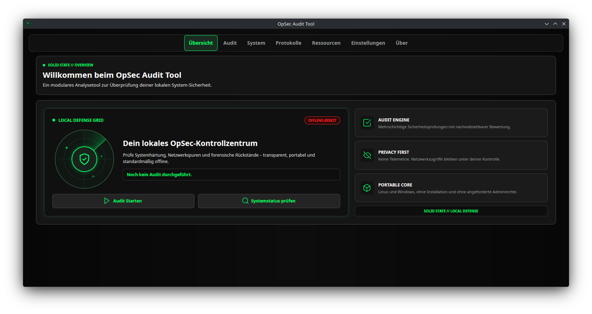
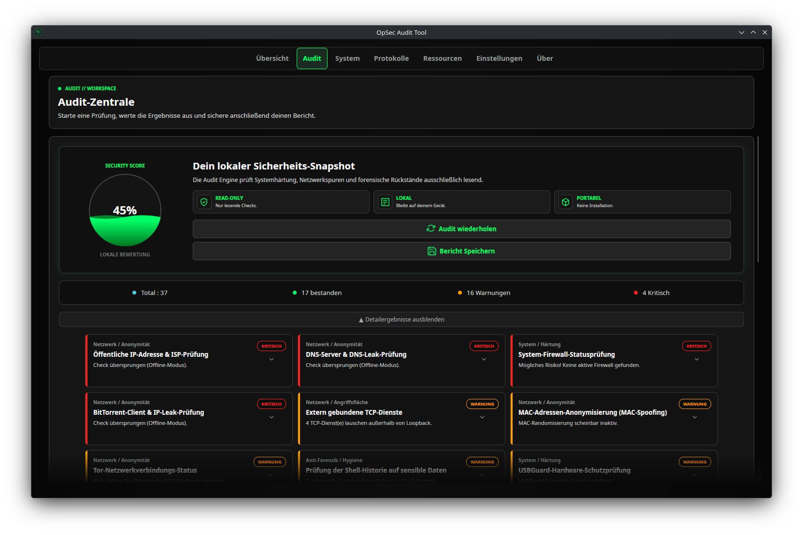

<p align="center">
  
</p>

<h1 align="center">OpSec Audit Tool</h1>

<p align="center">
  <b>Enterprise-Grade, Zero-Admin OpSec-, Forensik- & Systemhärtungs-Engine für Linux und Windows</b><br>
  <i>„OpSec ist keine magische Liste von Regeln, die man blind befolgt – sondern kontinuierliche, messbare Verifikation.“</i>
</p>

<p align="center">
  <a href="https://github.com/SolidStateNetwork/OpSecAuditTool/releases/latest">
    
  </a>
  <a href="https://github.com/SolidStateNetwork/OpSecAuditTool/actions/workflows/build.yml">
    
  </a>
  
  
  <a href="LICENSE">
    
  </a>
</p>

---

## 📸 Cyber-Terminal UI & Live-Audit

<p align="center">
  
</p>
<p align="center">
  <i>Das Kontrollzentrum mit interaktivem Radar, Echtzeit-Statusanzeigen und sofortigem Zugriff auf Systemdiagnose und OpSec-Bibel.</i>
</p>

<p align="center">
  
</p>
<p align="center">
  <i>Präzise Audit-Auswertung mit Signalfarben, aufklappbaren technischen Detail-Befunden und 1-Klick User-Space Quick-Fixes.</i>
</p>

---

## 🧠 Warum Nerds & Sysadmins dieses Tool lieben

- **🛡️ 100 % User-Space & Sudo-frei**: Führt tiefe Systemanalysen (SSH-Konfigurationen, Sudoers, Kernel-Flags, Container-Rechte, RAM-Auszüge) im normalen Benutzerkontext aus – ohne `root`-Rechte anzufordern oder bei UAC-Barrieren abzustürzen.
- **🌐 Universal-Port-Scanner (0–65535)**: Analysiert Kernel-Socket-Tabellen (`ss -tln` / `/proc/net/tcp`) und unterscheidet glasklar zwischen **öffentlich exponierten Ports (`0.0.0.0` / `[::]`)** und **lokal gebundenen Diensten (`127.0.0.1` / `[::1]`)** inkl. AI-/DB-Stack-Erkennung (`Ollama`, `Redis`, `PostgreSQL`, `MongoDB` etc.).
- **🧅 Dynamischer Tor- & Privacy-Audit**: Erkennt native, Flatpak- oder Snap-basierte `torrc`-Konfigurationen dynamisch, verifiziert `SocksPort`/`ControlPort` und prüft den aktiven Tor-Daemon.
- **⚡ Asynchrone 58-Checker-Engine**: Die parallele Core-Engine nutzt `SemaphoreSlim`-Scheduling, läuft absolut rückrufsicher im Hintergrund und hält die GUI mit 60 FPS reaktionsschnell.
- **⚡ One-Click User-Space Quick-Fixes**: Sofortige Automations-Fixes für erkannte Schwachstellen direkt im User-Space (z. B. Hashing von SSH `known_hosts`, WebRTC IP-Leak-Schutz in Firefox `user.js`, Härten von `pip`/`npm`, Bereinigung von AI-Tooling-Tokens).
- **🎨 Globalisiertes Neon-Design & Live-Konsole**: Maßgeschneidertes Avalonia-Theme (`AppStyles.axaml`) mit flüssigem Farbverlauf, farbcodiertem Log-Stream und dediziertem `ConsoleLogPresenter`.
- **🔒 Zero Telemetry & Offline-First**: Kein Nachladen externer Skripte, keine Tracker, keine Cloud-Abhängigkeiten. 100 % der Daten bleiben auf deinem Gerät.

---

## 🔍 Die 58 Core-Checker im Überblick

Das Tool teilt seine 58 modularen Prüfungen in vier präzise Fachbereiche auf:

| Domäne | Wichtigste Checker & Analysen |
| :--- | :--- |
| **🛡️ System & Härtung** | `SshHardeningChecker`, `SshClientConfigChecker`, `SshKnownHostsHygieneChecker`, `DockerPodmanSecurityChecker`, `DisplayServerSecurityChecker` (Wayland/X11), `GitSecurityConfigChecker`, `GpgKeySecurityChecker`, `HardwareAuthTokenChecker` (FIDO2/U2F), `SudoersChecker`, `ShellStartupPersistenceChecker`, `UserAutostartChecker`, `DiskEncryptionChecker` (LUKS), `FirewallChecker` |
| **🔬 Forensik & Anti-Forensik** | `WebRtcLeakChecker`, `MessengerStoragePrivacyChecker` (Signal/Telegram/Discord), `LocalCrashDumpFileChecker` (RAM-Auszüge in `.core`/`.dmp`), `BrowserStorageChecker` (Native/Flatpak/Snap), `BrowserExtensionAuditChecker`, `TrashChecker`, `ClipboardChecker`, `TmpFsChecker` (`/tmp` im RAM), `RecentFilesChecker`, `ThumbnailCacheChecker`, `SystemLogScrubberChecker` |
| **🧪 Diagnostik & Hygiene** | `AiToolingPrivacyChecker` (Klartext-Tokens in Aider/Cursor/Copilot/Continue), `EnvironmentSecretChecker` (`OPENAI_API_KEY`, AWS, GCP, JWT), `ShellHistoryChecker` (asynchrone Suche nach Klartext-Passwörtern in 15.000 Zeilen History), `CrashReportChecker` (`coredumpctl`) |
| **🌐 Netzwerk & Privacy** | `OpenPortsChecker` (65.536 Ports mit Bindungsanalyse), `TorConfigurationChecker`, `EncryptedDnsChecker` (DoT/DoH), `DnsLeakChecker`, `PublicIpChecker`, `MacSpoofChecker`, `VpnInterfaceChecker`, `WebRtcLeakChecker` |

---

## 🚀 Schnellstart & Portabilität

### 1. Portables Release (Keine Installation nötig)
Lade das passende Paket vom [aktuellen Release](https://github.com/SolidStateNetwork/OpSecAuditTool/releases/latest) herunter:

```bash
# Linux x64 (Self-Contained inkl. .NET Runtime)
tar -xzf OpSecAuditTool-v1.1.0-linux-x64.tar.gz
./OpSecAuditTool

# Prüfsumme verifizieren
sha256sum -c SHA256SUMS.txt
```

### 2. Für Entwickler (Build from Source)
```bash
git clone https://github.com/SolidStateNetwork/OpSecAuditTool.git
cd OpSecAuditTool
dotnet run
```

---

## 📐 Architektur (Under the Hood)

```
+-------------------------------------------------------------------------+
|                              Avalonia UI                                |
|   (MainWindow / Cyber-Terminal Theme / TabControl / Live-Console-View)  |
+------------------------------------+------------------------------------+
                                     |
                                     v
+-------------------------------------------------------------------------+
|                         ConsoleLogPresenter                             |
|          (Batch-Queue, DispatcherTimer, Auto-Follow Scrolling)          |
+------------------------------------+------------------------------------+
                                     |
                                     v
+-------------------------------------------------------------------------+
|                        AuditRunnerViewModel                             |
|       (Asynchrone Orchestrierung, SemaphoreSlim, Quick-Fix Engine)      |
+------------------------------------+------------------------------------+
                                     |
                                     v
+-------------------------------------------------------------------------+
|                      OpSecCore (58 Core Checkers)                       |
|   Security  |  Forensics  |  Diagnostics  |  Network  |  BackupService  |
+------------------------------------+------------------------------------+
                                     |
                                     v
+-------------------------------------------------------------------------+
|                    OS / Kernel Interface (User-Space)                   |
|       /proc/net/tcp | ss -tln | torrc | dbus | ~/.ssh | ~Browser        |
+-------------------------------------------------------------------------+
```

---

## 📜 Lizenz & Beitrag
Veröffentlicht unter der **MIT-Lizenz**. Contributions, neue Checker und Pull Requests sind jederzeit willkommen – siehe [CONTRIBUTING.md](CONTRIBUTING.md).
